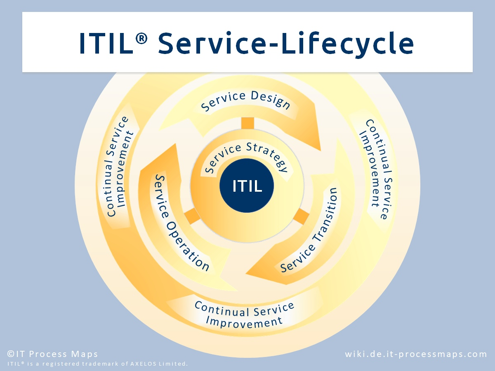

# ITILv3 Service Operations

## ITIL im Allgemeinen
ITIL steht für Information Technology Infrastructure Library und ist eine Sammlung vordefinierter Prozesse, Funktionen und Rollen in der IT-Infrastruktur.

ITIL gibt an wie man am besten einen Service ausführt oder ein Problem löst.

Darüber hinaus bietet es auch die Möglichkeit den Vorschlag aus dem ITIL Handbuch an seine Kunden und Nutzer anzupassen, um die best mögliche Lösung für diese zu kreieren.

ITILv3 ist Lifecycle basiert und ist in die fünf folgenden Phasen unterteilt:

- Service-Strategie
- Service-Design
- Service-Transition
- Service-Operation
- Continual Service Improvement

 

## Service Operation im Allgemeinen
ITIL Service Operation stellt sicher, dass die IT Services effektiv und effizient erbracht werden. Die Service-Operation-Phase beinhaltet die Erfüllung von Anwender-Anfragen und Erarbeitung von Problemlösungen ebenso wie die Erbringung von Betriebsaufgaben im laufenden Tagesgeschäft.

### Ziele
- Effektive und effiziente Planung und Umsetzung der  Dienstleistungen
- Schaffung von Mehrwert für Kunden und Dienstleister
- Realisiert die strategischen Ziele durch operative Dienstleistungen
- Orientierungsrahmen, um stabile Leistungen zu erbringen und diese kontinuierlich an Kundenbedarf anzupassen
- Management der für die Lieferung und Unterstützung von Services erforderlichen Technologie

Wenn man von Service Operation spricht, unterscheidet man die folgenden Hauptprozesse:

### Event Management
Event Management stellt sicher, dass Services laufend überwacht werden und dass Events gefiltert und kategorisiert werden können, um gegebenenfalls Maßnahmen einzuleiten.

### Incident Management
Das Ziel des Incident Managements besteht darin, einen IT-Service für den Anwender so schnell wie möglich wieder herzustellen, wenn ein negativer Zwischenfall auftritt.

**Beispiel für einen Incident:**
Ein Fehler auf unserer Datenbank ist aufgetreten, dieser konnte jedoch so schnell wie möglich wieder behoben werden. 

### Access Management
Access Management verwaltet die Zugriffsrechte der Benutzer, sprich welcher Anwender autorisiert ist einen gewissen Service zu benutzen.

### Problem Management
Das Ziel ist die Verwaltung aller Probleme über ihren gesamten Lebenszyklus, sowie dem Auftreten von sich wiederholenden Incidents vorzubeugen und die Auswirkungen von Incidents, die sich nicht verhindern lassen, so minimal wie möglich zu halten.

**Beispiel für ein Problem:** 
Ein Fehler auf unserer Datenbank ist aufgetreten, dieser konnte nicht gelöst werden. 

### IT Operations Control
Das Ziel ist die laufenden Routinetätigkeiten in einem Unternehmen zu managen, die mit Infrastruktur-Komponenten und Anwendungen in Verbindung stehen.

### Facilities Management
Das Ziel ist die physikalischen Anlagen und Einrichtungen, sprich Gebäude, Hardware und Büroartikel, zu verwalten.

### Application Management
Das Ziel ist die Verwaltung von Applikationen über ihren gesamten Lebenszyklus. Dies beinhaltet die Installation, Wartung und Lizenzierung der benötigten Software. 

### Technical Management
Das Ziel ist es technisches Fachwissen und Unterstützung für das Management der IT-Infrastruktur zur Verfügung zu stellen.

### Service Desk
Der Service Desk ist die zentrale Anlaufstelle für alle Serviceanfragen und somit die Schnittstelle zwischen den Anforderungen des Kunden und dem umzusetzenden Geschäftsprozess. Er vermittelt zwischen Kunden und Dienstleister und ist in größeren Unternehmen meist als Callcenter bzw. Hotline vertreten. 